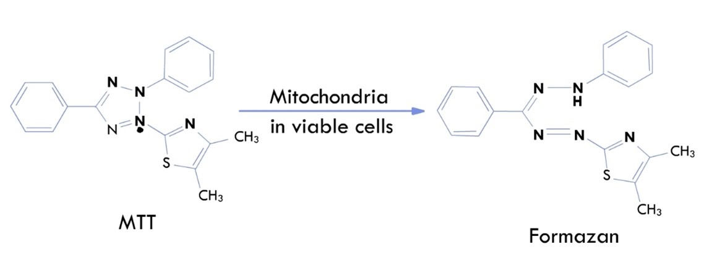
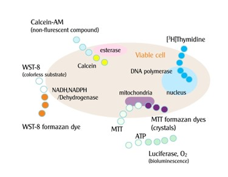
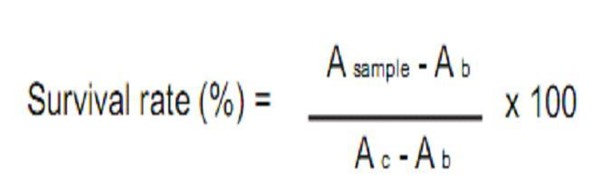

### Theory

Cell proliferation, also known as cell growth, cell division, or cell replication is the basic process through which cells form new cell. Cell proliferation is the increase in cell number as a result of cell division and growth. The process of cell proliferation depends on the prior occurrence of a series of internal cellular changes before either mitotic or meiotic division starts. These changes occur in a given orderly sequence known as the four phase of the cell cycle, and both mitosis and meiosis   are the final steps of a cell cycle.

The development of assays for measuring the survival of individual tumour cells revolutionized the study of experimental cancer therapy by enabling researchers to move from assessing the gross responses of tumours to measuring the survival of cells in the critical, clonogenic tumour cell population. The development and the use of these assays formed the basis for many of our modern concepts of tumour biology, from the concept of logarithmic cell kill to considerations of cell proliferation kinetics. The first major step in this revolution in cancer biology was made by Puck and Marcus, who developed the cell culture assay for cloning individual HeLa cells and then used this assay to determine the changes in cell survival in cultures given graded doses of radiation.

The accurate assessment of cell number and cell proliferation is useful in many high content assays and is a key read out in cytotoxicity and apoptosis applications. Proliferation assays such as MTT, XTT and WST-1 were commonly used for measuring biocompatibility. Enzyme-based methods using MTT and WST -1 is a reductive colouring agent and dehydrogenase in a viable cell to determine the cell viability with a colorimetric method. This method is considered superior to earlier techniques because it is easy to use, safe, highly reproducible, and widely adopted for both cell viability and cytotoxicity testing. Therefore, it is especially suitable for researchers who are new to such experiments. Among the enzyme-based assays, the MTT assay is the best-known methods for determining mitochondrial dehydrogenase activities in living cells.
 
&nbsp;

### Principle

The basis of the assay is as follows. Cells in the exponential phase are exposed to a cytotoxic drug. The duration of exposure is usually determined as the time required for maximal damage occurs but is also influenced by the stability of the drug. After removal of drug, the cells are allowed to proliferate for two or three doubling times in order to distinguish between cells that remain viable and are capable of proliferation and those that remain viable but cannot proliferate. Surviving cells numbers are then determined indirectly by MTT dye reduction.

The MTT cell proliferation assay is a quantitative colorimetric method to determine the cell proliferation. It utilizes the yellow tetrazolium salt (3-(4,5- dimethylthiazol-2-yl)-2,5- diphenyltetrazolium- bromide) which is metabolized by mitochondrial succinic dehydrogenase activity of proliferating cells to yield a purple formazan product by the mitochondria of viable cell. The MTT reagent should be stored at 4°C in the dark to maintain its stability and effectiveness. 

&nbsp;

Fig1: MTT reaction.
 
This is allowing 2-4 hours to develop purple formazan precipitate. The purple formazan has to be visible inside the cells before the detergent reagent is added. After incubation of the cell with the MTT reagent for approximately 2 to 4 hours, the detergent solution is added to lyse the cell and solubilise the coloured crystal. The detergent reagent can be stored at either 4°C or ambient temperature. If stored at 4°C, warm the bottle for 5 minutes at 37°C and gently mix by inverting before use, avoiding the formation of bubbles. The sample is read using a microtiter plate reader at a wavelength 570nm. The amount of colour produced is directly proportional to the number of viable cells.
 

&nbsp;

Fig 2 : Reagents for cell viability detection
 
To perform the proliferation assay for most of tumour cells, fibroblast and hybridoma cell lines, about 5,000 cell per well are recommended. And although 1,000 cells per well have been used successfully.

The cells with functional mitochondria are needed to convert the tetrazolium dye into its reduced form. Most of the eukaryotic cells in culture, including mammalian, yeast and plant cell types, reduce the dye sufficiently perform through this assay. For tumour cells, hybridomas, and fibroblast cell lines, which are recommended 5,000- 10,000 cells per well to perform. The cells are treated with drug, the drug may be inhibiting the cell growth or without any action. The time varying depending up on drug what we used.  

The assay will include
a. Blank wells containing medium only.

b. Control wells containing untreated cells

c. Test wells containing treated cells.

Absorbance can be measured in the range of wavelength from 550 - 600 nM with any filter. The balnk should give values close to zero (+/ - 0.1). Determine the average values from triplicate reading and the subtract the average value for the blank. Plot the concentration of drug against percentage of cell viability.

&nbsp;

### Calculation

From the absorbance reading from each well.

&nbsp;

A b = absorbance of blank

Ac = absorbance of negative control.

&nbsp;

### Data interpretation

Absorbance values that are lower than the control cells indicate a reduction in the rate of cell proliferation. Conversely a higher absorbance rate indicates an increase in cell proliferation. Rarely, an increase in proliferation may be offset by cell death; evidence of cell death may be inferred from morphological change.
